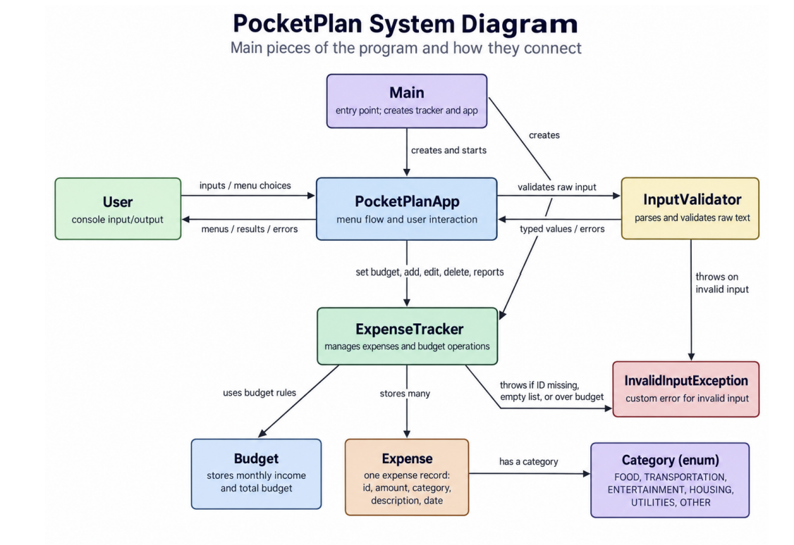

# PocketPlan

CS 2114 · Project 1 · Group 72
Essan Salem · Mckenna Bryan · Angelo Pinillos-Sternberg · Wenxin Zhang

A menu-driven Java console app for managing one monthly budget. You enter your
monthly income and a spending limit, then add, edit, and delete expenses. Each
expense records an amount, a category, a description, a date, and whether it is
habitual or non-habitual spending.

At any point you can view:

- total income, budget, spending, and money remaining
- a per-category breakdown and the highest-spending category
- the habitual versus non-habitual split of your spending

If you type something the program cannot use, it says what was wrong and asks
for that one field again. Anything you already entered is kept.

## How to compile and run

From the root of the repository:

```
javac -d bin src/pocketplan/Budget.java src/pocketplan/Category.java src/pocketplan/Expense.java src/pocketplan/ExpenseTracker.java src/pocketplan/InputValidator.java src/pocketplan/InvalidInputException.java src/pocketplan/Main.java src/pocketplan/PocketPlanApp.java
java -cp bin pocketplan.Main
```

Then follow the on-screen menu.

In Eclipse, import the project and run `Main.java` as a Java Application.

### Running the tests

The JUnit tests are in the same package and use `student.TestCase`, so they need
the CS2-Support library on the build path. In Eclipse, run any of the `*Test`
classes as a JUnit test. The compile command above leaves the test files out so
the program itself builds without that library.

## System diagram



## Classes

| Class | Job |
| --- | --- |
| `Main` | Creates the shared objects and starts the app |
| `PocketPlanApp` | Shows the menu, reads input, prints results and errors |
| `ExpenseTracker` | Owns the expense list; adds, edits, deletes, and calculates |
| `Expense` | One expense record that protects its own valid state |
| `Budget` | Monthly income and spending limit, and the limit rules |
| `Category` | The fixed set of allowed categories |
| `InputValidator` | Turns typed text into valid values |
| `InvalidInputException` | Carries a message about input the user can correct |

## A note on saved data

The MVP in our specification keeps one budget in memory for a single session.
Saving to CSV was listed there as deferred work, but we went ahead and built it,
so the program writes `budget.csv` and `expenses.csv` when it closes and reads
them back the next time it starts. Those two files are ignored by git so the
repository does not carry one person's saved budget.
